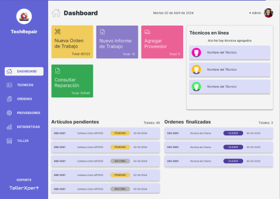
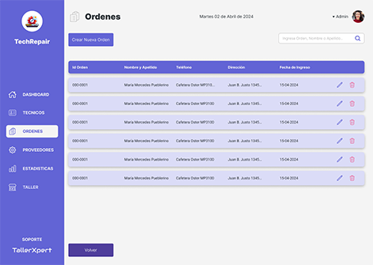
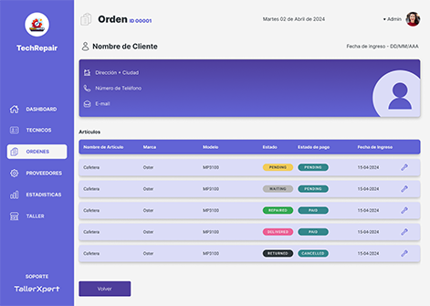
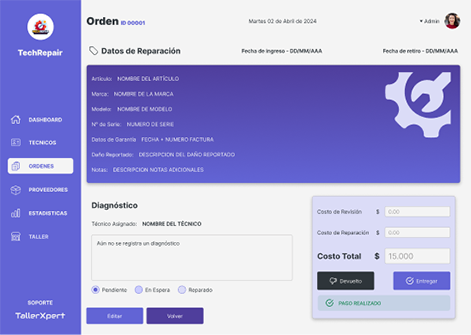

## Qué es TallerXpert?.

TallerXpert esta diseñado para permitir a varios usuarios registrar su taller dentro de una plataforma que da acceso exclusivo al uso de un software de gestión.

## El Producto

El software cumple con el objetivo de ayudar a sus usuarios a gestionar su taller a través de una interfaz amigable y lista que abarca cada etapa del flujo de su negocio.

- Registro de datos del Taller.
- Generación de ordenes de trabajo.
- Ingreso de datos de clientes.
- Control de sus reparaciónes.
- Registro de proveedores.
- Generación y registro de usuarios Técnicos a cargo de las reparaciones.
- Generación de informes técnicos.
- Notificaciones integradas por Email y Whatsapp.
- Implementación de pagos con MercadoPago.
- Generación de estadísticas de negocio. ( No incluido en MVP )

 

## Estudio de caso UX/UI.

Si quieres ver el estudio de caso completo descarga el siguiente pdf.

<a href="./frontend/src/assets/pdf/taller_xpert_caso_de_estudio.pdf" download>TallerXpert - Caso de Estudio</a>
 
<a href="./frontend/src/assets/pdf/guia_de_estilos.pdf" download>TallerXpert - Guía de estilos</a>
 
<a href="https://www.figma.com/file/wnxNd3ZYJKN4ebgvbZk4tz/TallerXpert?type=design&node-id=536%3A157&mode=design&t=bEGrCiDCmM8BCKfd-1">Link al FIGMA</a>

## Capturas Generales

    
    
    
    

## Tecnologías implementadas

### 🧩 Backend

- Node.js
- Express
- Sequelize ORM
- Swagger

### 🪄 Frontend

- Next.js
- Typescript
- Librerias Externas: Sweet Alert 2 - React-Hook-Form
- MercadoPago API
- Whatsapp API

### 🎨 UXUI

- Figma

## Deploy del proyecto

<a href="https://s14-36-t-node-react.vercel.app">Ir al deploy Frontend</a>
 
<a href="https://s14-36-t-node-react.onrender.com/">Ir al deploy Backend</a>

## Integrantes y Roles del Equipo

<section style="max-width: 1200px; display:flex; flex-wrap: wrap; gap: 16px;">
    <!--[Rocío Graff]-->
    <article style="display:inline-block; width: 200px; padding:16px; border:solid 1px gray; border-radius: 8px; background-color:#848484; overflow:hidden;">
        <h3 style="margin: 0 0 16px 0; text-align:center; color:black;">Rocío Graff</h3>
            

                
                <h6 style="">Product Manager Backend Dev Frontend Dev</h6>
            

            

                
            

    </article>
    <!--[Bruno Ken]-->
    <article style="display:inline-block; width: 200px; padding:16px; border:solid 1px gray; border-radius: 8px; background-color:#848484; overflow:hidden;">
        <h3 style="margin: 0 0 16px 0; text-align:center; color:black;">Bruno Ken</h3>
            

                
                <h6 style="">Backend Dev Frontend Dev</h6>
            

            

                
            

    </article>
    <!--[Sebastian Castiblanco]-->
     <article style="display:inline-block; width: 200px; padding:16px; border:solid 1px gray; border-radius: 8px; background-color:#848484; overflow:hidden;">
        <h3 style="margin: 0 0 16px 0; text-align:center; color:black;">Sebastian Castiblanco</h3>
            

                
                <h6 style="">Backend Dev</h6>
            

            

                
            

    </article>
    <!--[Luis Guzman]-->
    <article style="display:inline-block; width: 200px; padding:16px; border:solid 1px gray; border-radius: 8px; background-color:#848484; overflow:hidden;">
        <h3 style="margin: 0 0 16px 0; text-align:center; color:black;">Luis Guzman</h3>
            

                
                <h6 style="">Backend Dev</h6>
            

            

                
            

    </article>
    <!--[Sonny Pimentel]-->
    <article style="display:inline-block; width: 200px; padding:16px; border:solid 1px gray; border-radius: 8px; background-color:#848484; overflow:hidden;">
        <h3 style="margin: 0 0 16px 0; text-align:center; color:black;">Sonny Pimentel</h3>
            

                
                <h6 style="">Backend Dev</h6>
            

            

                
            

    </article>
    <!--[Matias Paredes]-->
    <article style="display:inline-block; width: 200px; padding:16px; border:solid 1px gray; border-radius: 8px; background-color:#848484; overflow:hidden;">
        <h3 style="margin: 0 0 16px 0; text-align:center; color:black;">Matias Paredes</h3>
            

                
                <h6 style="">Backend Dev</h6>
            

            

                
            

    </article>
    <!--[David Hilera]-->
    <article style="display:inline-block; width: 200px; padding:16px; border:solid 1px gray; border-radius: 8px; background-color:#848484; overflow:hidden;">
        <h3 style="margin: 0 0 16px 0; text-align:center; color:black;">David Hilera</h3>
            

                
                <h6 style="">Backend Dev</h6>
            

            

                
            

    </article>
    <!--[Mariana Potichkin]-->
    <article style="display:inline-block; width: 200px; padding:16px; border:solid 1px gray; border-radius: 8px; background-color:#848484; overflow:hidden;">
        <h3 style="margin: 0 0 16px 0; text-align:center; color:black;">Mariana Potichkin</h3>
            

                
                <h6 style="">Frontend Dev</h6>
            

            

                
            

    </article>
    <!--[David Martinez]-->
    <article style="display:inline-block; width: 200px; padding:16px; border:solid 1px gray; border-radius: 8px; background-color:#848484; overflow:hidden;">
        <h3 style="margin: 0 0 16px 0; text-align:center; color:black;">David Martinez</h3>
            

                
                <h6 style="">Frontend Dev</h6>
            

            

                
            

    </article>
    <!--[Emanuel Valente]-->
    <article style="display:inline-block; width: 200px; padding:16px; border:solid 1px gray; border-radius: 8px; background-color:#848484; overflow:hidden;">
        <h3 style="margin: 0 0 16px 0; text-align:center; color:black;">Emanuel Valente</h3>
            

                
                <h6 style="">UX/UI Designer</h6>
            

            

                
            

    </article>

</section>

 
 
 

Gestionar tu taller nunca fue tán fácil.
